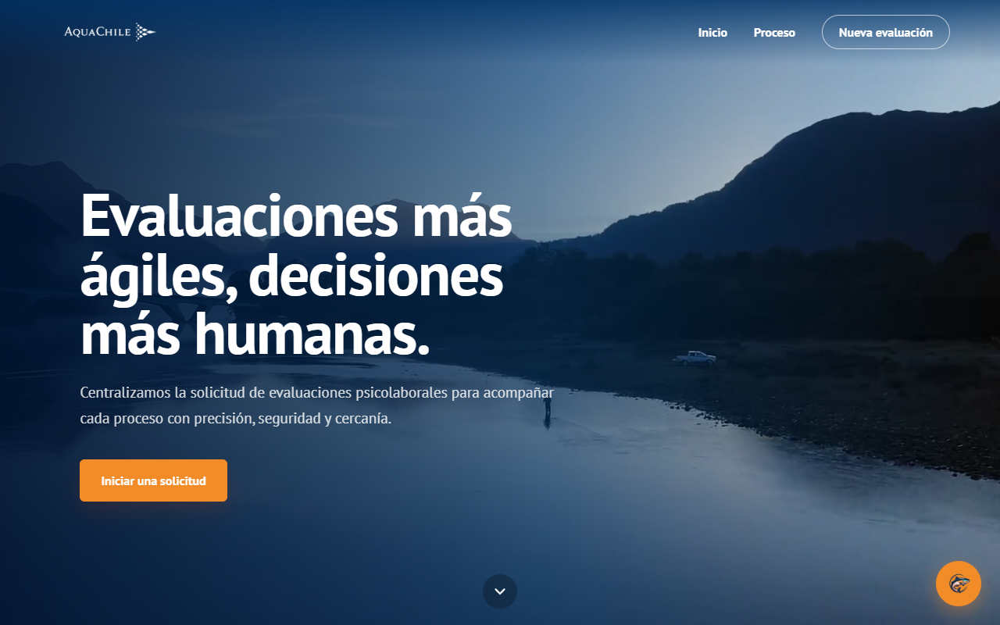
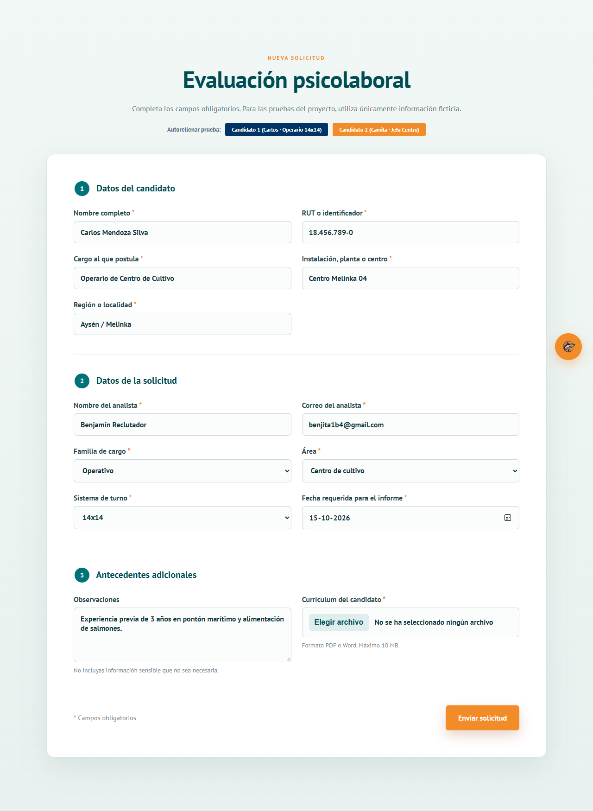
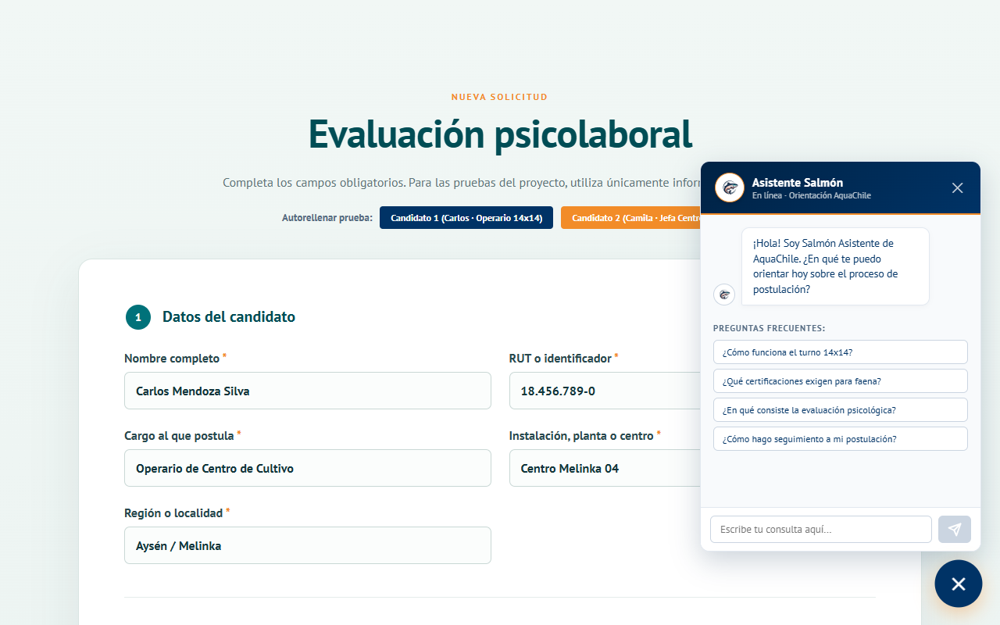
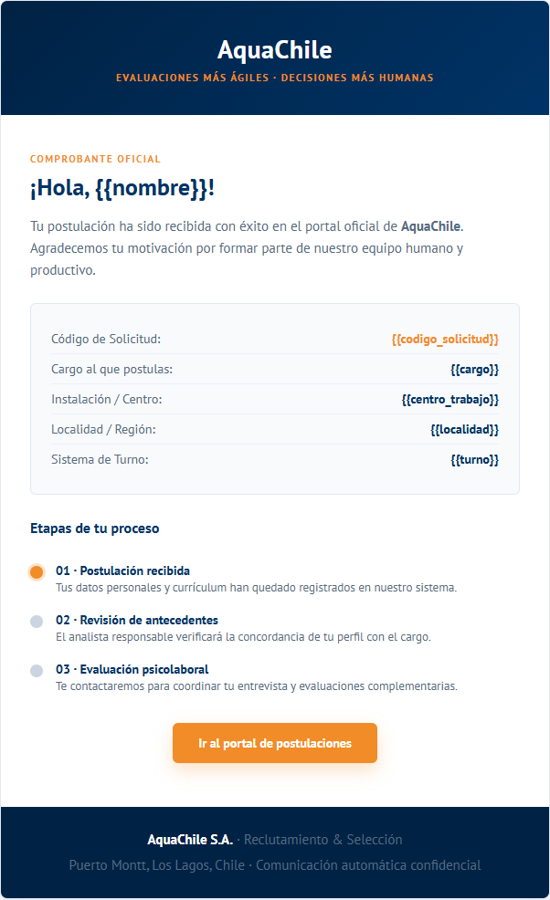

# Plataforma de Gestión y Evaluación Psicolaboral — AquaChile

Plataforma web para la digitalización, centralización y automatización del proceso de reclutamiento y selección de **AquaChile**. Optimiza la recepción de postulaciones operativas y técnicas en centros de cultivo y pisciculturas, integrando asistencia interactiva para el postulante y un módulo de soporte para el evaluador.

---

## 👥 Equipo y Distribución de Roles

| Integrante | Rol Principal | Responsabilidades |
|---|---|---|
| **Benjamín Agüero** (@yountek14) | **Backend, IA & Notificaciones** | Arquitectura del servidor (FastAPI), despacho automatizado de correos corporativos HTML (SMTP), lógica del asistente interactivo e integración con el motor de evaluación psicolaboral. |
| **Luis Fermín** (@Lguille99) | **Formularios, API & Persistencia** | Modelamiento de captura de antecedentes, validaciones de formularios de postulación interna/externa, endpoints de solicitudes y estructuración de base de datos relacional. |
| **Raúl Ferrini** (@Potasio230) | **Frontend & UI/UX** | Diseño de interfaz en React + Vite con identidad visual de AquaChile, experiencia de usuario responsiva, integración de video corporativo y layout de vistas principales. |

---

## 📸 Vistas de la Plataforma

### 1. Portal de Inicio y Marca AquaChile
Portal público institucional con video de fondo, navegación corporativa y presentación de las etapas de postulación.



---

### 2. Formulario de Postulación de Candidatos
Captura de antecedentes personales, cargo, instalación (piscicultura/pontón), turno (ej. 14x14) y subida de currículum vitae en PDF/Word. Incluye botones de prueba rápida para validación de flujo.



---

### 3. Asistente Salmón (Chatbot Flotante)
Asistente virtual interactivo en la esquina inferior derecha. Cuenta con avatar animado de salmón (boca abierta/cerrada al hablar), efecto máquina de escribir (*typewriter*) y preguntas frecuentes directas sobre turnos 14x14, certificaciones y etapas del proceso.



---

### 4. Notificaciones por Correo Electrónico (HTML)
Despacho automático de comprobantes oficiales con la paleta de colores de AquaChile (azul marino y naranja institucional):
- **Candidato:** Comprobante de postulación recibida con código de seguimiento y resumen de etapas.
- **Analista de Selección:** Notificación con la ficha técnica del nuevo postulante y fecha límite requerida.



---

## 🛠️ Tecnologías y Arquitectura

- **Frontend:** React 19, Vite, CSS moderno responsivo, Google Fonts (`PT Sans`).
- **Backend & APIs:** FastAPI / Python + Node.js Express.
- **Motor de Notificaciones:** Python `smtplib` con plantillas HTML dinámicas (`templates/`).
- **Procesamiento de Documentos:** PyMuPDF (`fitz`) para extracción y lectura de CVs en PDF.
- **IA & Asistencia:** Arquitectura híbrida de soporte al evaluador con glosario técnico acuícola y asistente en tiempo real.

---

## 📌 Tareas Pendientes y Próximos Pasos

- [ ] **Base de Datos Relacional:** Implementar el esquema relacional definitivo (PostgreSQL / Oracle) reemplazando la persistencia temporal en disco/memoria.
- [ ] **Bandeja de Gestión Interna (Dashboard RRHH):** Visualización tabular de candidatos con filtros avanzados por centro de cultivo, localidad, turno y analista asignado.
- [ ] **Pipeline de Estados:** Gestión del ciclo de vida del candidato (*Postulado → En Revisión → Citado → Evaluado → Apto/No Apto*).
- [ ] **Módulo Psicolaboral del Evaluador:** Conectar el pre-filtro de compatibilidad del CV con la cabina de entrevista del psicólogo.
- [ ] **Autenticación y Roles:** Control de acceso basado en roles (Candidato externo vs. Analista RRHH vs. Psicólogo evaluador).
- [ ] **Almacenamiento de Archivos en la Nube:** Migración de almacenamiento de CVs y grabaciones a un almacenamiento de objetos seguro (S3 / Azure Blob).

---

## 🚀 Puesta en Marcha Local

### Requisitos
- Node.js (v18+)
- Python (v3.10+)

### 1. Iniciar el Frontend
```bash
cd repo_equipo
npm install
npm run dev
```
La aplicación abrirá en: `http://localhost:5173/`

### 2. Iniciar el Backend & Servicios
```bash
cd AquaChileAgente
pip install -r requirements.txt
python -m uvicorn api.app:app --host 127.0.0.1 --port 8000 --reload
```
API y documentación Swagger en: `http://127.0.0.1:8000/docs`
